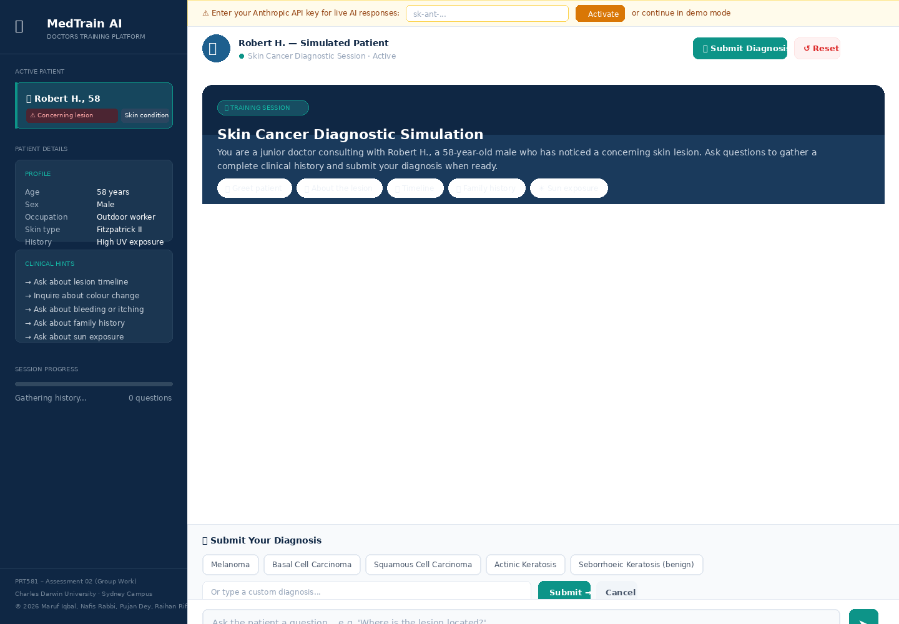
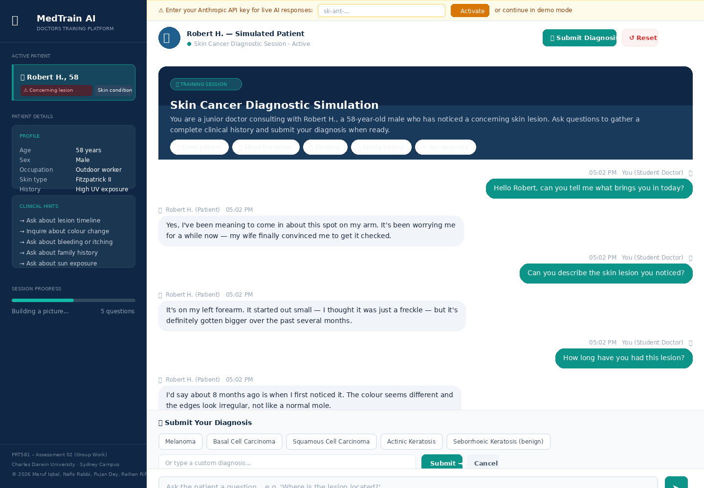
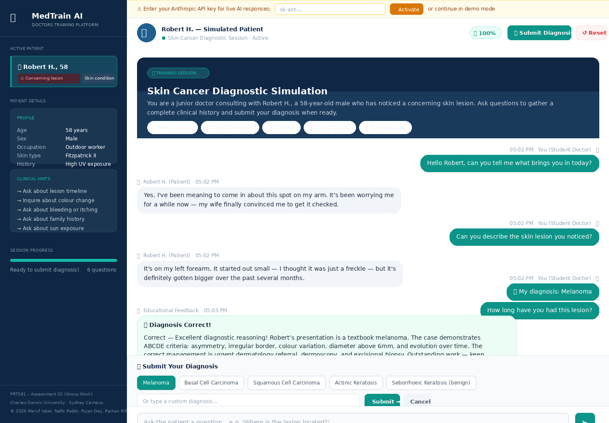
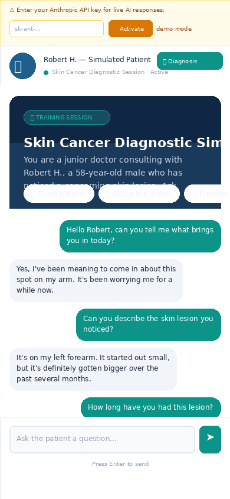

# MedTrain AI — Doctors Training Chatbot

**PRT581: Software Engineering Project — Assessment 02**  
Charles Darwin University · Sydney Campus  
Group: Mohammad Maruf Iqbal (S398392) · Md. Nafis Rabbi (S398606) · Pujan Dey (S395076) · Raihan Rifat (S374528)

---

## 📋 Project Overview

MedTrain AI is an interactive, AI-powered medical education platform that simulates a **skin cancer patient** for diagnostic training. Medical students practice clinical history-taking, symptom questioning, and diagnosis in a safe, repeatable environment.

The chatbot acts as **Robert H., a 58-year-old male** presenting with a concerning skin lesion. Students ask questions, gather a clinical history, and submit a diagnosis — then receive detailed educational feedback.

---

## 🚀 Live Demo

👉 **[Demo Website](https://nafisrabbi.github.io/prt581-chatbot)**


---

## 🛠️ Tech Stack

| Layer | Technology |
|-------|-----------|
| Frontend | HTML5, CSS3, Vanilla JavaScript |
| AI / NLP | Anthropic Claude API (`claude-sonnet-4-20250514`) |
| Hosting | GitHub Pages |
| Fonts | Google Fonts (DM Sans, DM Serif Display) |

---

## 📁 File Structure

```
/
├── index.html          # Main application page
├── css/
│   └── style.css       # All styles
├── js/
│   ├── config.js       # AI prompts & API configuration
│   ├── chat.js         # API calls & conversation logic
│   ├── ui.js           # DOM rendering & UI state
│   └── app.js          # Initialisation & entry point
└── README.md
```

---

## 🎓 How to Use the App

1. **Read the patient sidebar** — note Robert's profile, age, occupation, and clinical hints
2. **Ask questions** — type freely or click the quick-start chips
3. **Gather a full history** — ask about the lesion, timeline, family history, sun exposure
4. **Submit your diagnosis** — click the **Submit Diagnosis** button when ready
5. **Review feedback** — the system evaluates your diagnosis using ABCDE criteria
6. **Reset and retry** — click **Reset** to start a new session

---

## 📸 Screenshots


*Figure 1: User Interface of the Application*


*Figure 2: Chat Conversation*


*Figure 3: Diagnosis Feedback*


*Figure 4: Mobile View*

---

## 📚 References

- Anthropic. (2025). *Claude API Documentation*. https://docs.anthropic.com
- Cancer Council Australia. (2024). *Skin Cancer*. https://www.cancer.org.au
- World Health Organization. (2023). *Skin Cancers*. https://www.who.int

---

